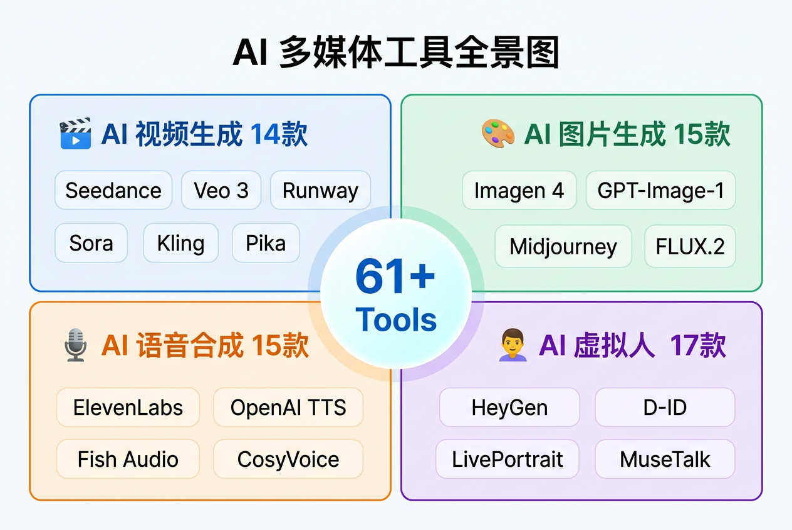

# AI 多媒体工具百科

> 61+ 款 AI 多媒体工具调研、对比与 MCP 集成指南

**线上地址**: http://video.rxcloud.group/



## 内容覆盖

| 类别 | 工具数量 | 代表工具 |
|------|---------|---------|
| AI 视频生成 | 14 款 | Seedance、Veo 3、Runway、Sora、Kling |
| AI 图片生成 | 15 款 | Imagen 4、GPT-Image-1、Midjourney、FLUX.2 |
| AI 语音合成 | 15 款 | ElevenLabs、OpenAI TTS、Fish Audio、CosyVoice |
| AI 虚拟人 | 17 款 | HeyGen、D-ID、LivePortrait、MuseTalk |

## 4 大工作流

| 工作流 | 流程 | 预估成本 |
|--------|------|---------|
| [营销视频制作](http://video.rxcloud.group/workflows/marketing-video) | 脚本 → 配图 → 配音 → 数字人 → 视频 | ~$1.68-$2.11 |
| [图文内容创作](http://video.rxcloud.group/workflows/image-content) | 文案 → 封面 → 配图 → 图标 | ~$0.11-$0.13 |
| [有声内容制作](http://video.rxcloud.group/workflows/audio-production) | 稿件 → 语音 → 多角色 → BGM | ~$0.61-$2.11 |
| [数字人制作](http://video.rxcloud.group/workflows/digital-human) | 形象 → 动作 → 唇形 → 互动 | ~$0.54 |

## 特色

- **61+ 工具对比** — 一表看全，按场景快速选型
- **MCP 集成** — 每款工具的 Claude Code MCP Server 配置命令
- **提示词模板** — 可复制粘贴，支持参数替换
- **成本估算** — 每步预估成本，帮助预算规划
- **开源推荐** — MoneyPrinterTurbo、LivePortrait、CosyVoice 等

## 本地开发

```bash
npm install
npm run docs:dev      # 开发
npm run docs:build    # 构建
npm run docs:preview  # 预览
```

## License

MIT
